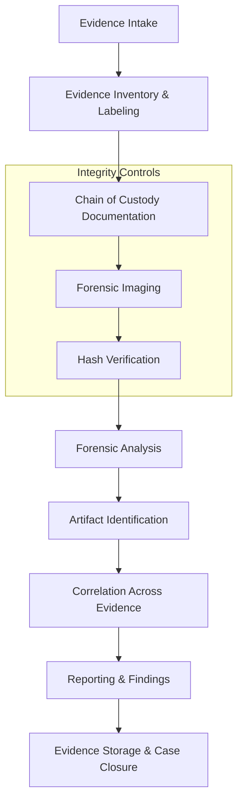

# Digital Forensic Analysis – Management of Digital Evidence Course

## 📌 Course Overview
This repository contains my **final forensic case analysis** for the *Forensics Management of Digital Evidence* course (FCM 760).  
The project simulates a **real-world law enforcement digital forensic investigation**, emphasizing **proper evidence handling, documentation, analysis methodology, and reporting**.

All work was conducted following **forensic best practices**, maintaining evidence integrity, chain of custody, and reproducibility.

## 🚀 Achievements / Skill Demonstrated
- Digital Evidence Handling & Chain of Custody
- Forensic Imaging & Hash Verification
- Disk & File System Analysis
- Artifact Correlation Across Devices
- DFIR Reporting & Documentation
- Legal & Ethical Considerations in Digital Forensics

## 🕵️ Case Scenario Summary

### Evidence 1 – Desktop Computer
A desktop computer purchased via Craigslist was turned over to law enforcement after the buyer discovered **suspicious image content** on the hard drive.  
The device was vouchered as **Investigatory Evidence**, and a **bit-by-bit forensic image** was created by the Monterey Police Department.

**Objectives included:**
- Identifying the file system and logical structure
- Determining user attribution
- Identifying connected USB devices
- Locating and analyzing image files
- Identifying potential personal identifiers of the original owner

---

### Evidence 2 – Removable Media (USB Thumb Drive)
Following analysis of Evidence 1, a **search warrant** led to the seizure of additional digital media.

**Objectives included:**
- Identifying related image files on removable media
- Correlating usage between devices
- Establishing a linkage between users across evidence sources
- Reporting findings in a concise forensic summary

## 🧩 Forensic Workflow Diagram

## 🧪 Tools & Techniques Used
- **FTK Imager** – Evidence verification and hash validation  
- **Autopsy (Sleuth Kit)** – File system, timeline, and artifact analysis  
- **Standard Forensic Forms** – Evidence intake, inventory, and chain of custody  
- **Hash Verification** – Ensuring integrity of forensic images  

All analysis was conducted on **forensic copies only**, never original evidence.

## 📂 Repository Structure

> ⚠️ **Note:** Evidence files are included **for academic purposes only** and contain **sanitized or controlled data**. No real personal data is disclosed publicly.

📁 Forms/

├── Incident_Response_Form.pdf

├── Evidence_Inventory_Form.pdf

└── Chain_of_Custody.pdf

📁 Hashes/

├── Evidence_1_Hash.png

└── Evidence_2_Hash.png

📁 Report/

└── Final_Forensic_Report.pdf

📁 Electronic_Reports/

├── Evidence_1_Report.html

└── Evidence_2_Report.html

## 📑 Key Forensic Questions Addressed
- File system and partition identification  
- Logical drive analysis  
- USB device history  
- User attribution  
- Image artifact discovery and categorization  
- Cross-device correlation  
- Evidence integrity validation  

## 🔐 Evidence Handling & Integrity
This project strictly followed:
- Proper **chain of custody**
- **Evidence inventory documentation**
- **Hash verification before and after analysis**
- Industry-standard **forensic workflow**

These practices ensure findings are **legally defensible and repeatable**.

## 🎓 Academic Disclaimer
This repository was created **solely for educational purposes** as part of a university forensic investigation course.
All scenarios, evidence, and reports are part of a **controlled academic exercise**.

The dates on the forms have been **intentionally adjusted**, as the evidence originated from events that occurred many years ago.

